  

  

  
  
  
  
  
  
  
  

### `$ cat about.txt`

I turn messy data into reliable dashboards, automated reports and ETL pipelines.
7 years working with data at companies like **NTT DATA, Atento and Stefanini**.

- 📊 ~60% less analysis time with KPI dashboards in Power BI
- ⚡ ~50% faster queries after SQL Server tuning (indexes, partitions, stored procedures)
- 🤖 Request workflow automated: response time from 24h → 6h, 98% SLA compliance

### `$ ls ./featured`

| Project | What it shows |
|---|---|
| [**sql-server-kpi-reporting**](https://github.com/yesuyashiro/sql-server-kpi-reporting) | Star schema · incremental ETL · 9 data quality checks · measured tuning (−99% CPU) on 5M rows |

  

### `$ contact --freelance`

Power BI dashboards · report automation · SQL Server · ETL pipelines
📫 [LinkedIn](https://www.linkedin.com/in/israellaurasuyo/)

SVGs are generated daily by a GitHub Action in this repo (`scripts/generate.mjs`), no third-party services.
